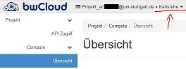
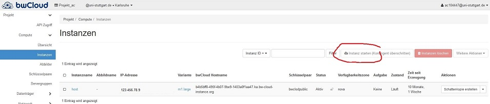

# Ein CSS Server in der BW-Cloud

Dieses Skript erklärt, wie man einen Linux Server für CSS Anwendungen einrichtet.
Die benötigte Software für CSS Anwendungen ist frei verfügbar. Anstatt eigene Hardware zu nutzen, wird der Server auf der [bwCloud](http://www.bw-cloud.org) eingerichtet.

## Die bwCloud - ein eigener Server für CSS Anwendungen

[](http://www.bw-cloud.org) 

Die [bwCloud](http://www.bw-cloud.org) ist IaaS - Infrasctructure as a Service, also (Rechner-)Infrastruktur, die als Dienstleistung bereitsgestellt wird (durch das Land Baden-WÜrttemberg, für die Hochschulen im Land). 

Was wird genau bereitgestellt? Die bwCloud ist verteilt auf vier Rechenzentren, im bwCloud-Jargon *Regionen*. Zusammen stellen die Großrechner 125 CPUs mit über 2.000 Kernen bereit und verfügen über 3.000 Terabyte Speicher. Davo erhalten registrierte NutzerInnen ein Kontingent (i.d.R. 8 Kerne, 16GB Arbeitsspeicher,50GB Speicher). Dieses *Kontingent* kann man nutzen, um sogenannte *Instanzen* ([Virtuelle Maschinen](https://de.wikipedia.org/wiki/Virtuelle_Maschine) einzurichtenm z.B. mehrere kleine oder eine große.

Verwaltet werden die Ressourcen und Instanzen mittels *Openstack*. Für uns Anwender ist das eine Weboberfläche, die es erlaubt Instanzen einzurichten, zu ändern, zu löschen etc. 


## 1. Erste Schritte - bwcloud und VM Zugang


Die [bwcloud](www.bw-cloud.org) steht allen Mitarbeitern baden-württembergischer Universitäten nach einer kurzen Registrierung zur Verfügung (siehe [erste Schritte](https://www.bw-cloud.org/de/erste_schritte)). Danach kann man sich mit dem regulären ac-Account oder st-Account (ac######@uni-stuttgart.de) [hier](https://portal.bw-cloud.org/auth/login/?next=/) anmelden. Die Instanzen sind personenbezogen und nicht an Funktionen oder Institutionen.

> Jeder ist für seine Instanz mit root-Rechten selbst verantwortlich (und haftbar), es gibt keinen Admin, der in die jeweilige Instanz reinschaut und sie auf Sicherheitsprobleme prüft. 

Falls nach der Anmeldung keine verfügbaren Kontingente angezeigt werden, liegt das wahrscheinlich daran, dass die falsche Region ausgewählt ist. Mitarbeiter der Uni-Stuttgart erhalten ihr Kontingent in der Rregel über die Region Karlsruhe:

 

Zuerst wird eine VM Instanz in der bwcloud unter `Compute -> Instanzen` angelegt:

 

Ein Image aus der Liste auswählen, oder ein eigenes unter `Abbilder` hochladen und installieren.

Läuft die Instanz, erfolgt der Zugriff über SSH (z.B. mit [Putty](https://www.putty.org/). Dies erfordert einen SSH-Schlüssel zur Authentifizierung (siehe [hier](https://www.bw-cloud.org/de/erste_schritte#step4)).  Dieser muss in Putty importiert werden: `Connection -> SSH -> Auth`. 

Jetzt noch die IP-Adresse des Servers (bei `Instanzen`) notieren und mit Putty auf den Server verbinden. 

## 2. Server einrichten 

Wird eine minimal CentOS insatlliert, sollten noch der Nano Texteditor und wget installiert werden:

```
sudo yum install nano
sudo yum install wget
```

Aus Sicherheitsgründen sollten Updates per Cron-Job automatisiert werden (vgl. [hier](https://linuxaria.com/howto/enabling-automatic-updates-in-centos-7-and-rhel-7)):

```
sudo yum -y install yum-cron
sudo nano /etc/yum/yum-cron.conf
systemctl start yum-cron.service
#Prüfen ob Service läuft
systemctl status yum-cron.service
```

### Netzlaufwerk
Jetzt noch das Netzlaufwerk so konfigurieren, dass es sich automatisch verbindet. Dafür einen Ordner anlegen, in dem das Laufwerk gemounted werden soll:

```
cd /home/NAME/
mkdir ORDNERNAME
```

Dann konfigurieren (z.B. für das Sowi-7-Share):

```
sudo yum install cifs-utils
# Credentials hinterlegen:
sudo nano /root/.mntcred
#edit
username=ac123456 
passwd=xyz

#Dann fstab bearbeiten:
sudo nano /etc/fstab
# edit
//sowi-cifs.tik.uni-stuttgart.de/Sowi2/shared/Sowi-7) /home/NAME/ORDNERNAME cifs credentials=/root/.mntcred,uid=1000,gid=1000 0 0
```

> PROBLEM: Der bwcloud-Server ist nicht Teil des Uni-Stuttgart Netzwerks, das Netzlaufwerk ist also nur über VPN erreichbar. Derzeit (22.01.2020) fehlt eine Datei vom TIK. Die prüen, was sie tun können. Solange Dateitransfer mit `pscp` von Putty.

### Bw-cloud als Netzlaufwerk im Windows Rechner einrichten

Das ist noch ein todo: Beispiel siehe: https://elearning.wsldp.com/pcmagazine/install-centos-samba-server/

### pscp Dateitransfer

Um Dateien von und zum Server zu schicken, lässt sich das Tool `pscp` nutzen, das mitinstalliert wird, wenn man Putty auf dem Windows-Rechner installiert.
`pscp` wird von  der Kommandozeile aus gestartet. Um eine Datei *vom Server auf den lokalen Rechner zu kopieren*, auf dem Windows-Rechenr also `cmd` ausführen. Dann:

```
pscp -i "Pfad_zum_private_key" nutzername@server_IP:/Dateipfad/auf/Server/datei.txt C:\Zielpfad\auf\Windows-Rechner
```

Um eine Datei *auf den Server zu kopieren*, wieder `cmd` und dann: 

```
pscp -i "Pfad_zum_private_key" C:\Quelldatei\auf\Windows-Rechner\datei.txt nutzername@server_IP:/Zielpfaf/auf/Server/ 
```


### Python auf Server installieren 

Python am besten für jedes Projekt in einer virtuellen Umgebung einrichten mit `virtualenv`. Dazu `virtualenv` für Python 3.6 installieren, dann wechseln in das entsprechende Projekt-Verzeichnis, dann virtuelle Umgebung einnrichten und aktivieren.
```
sudo yum install openssl-devel.x86_64
sudo python3.6 -m pip  install virtualenv
cd /home/NAME/PROJEKT
virtualenv -p python3.6 env
source env/bin/activate
```

Libraries können dann einfach über `requirements.txt` insatlliert werden:
```
pip install -r requirements.txt
```

### RStudio Server installieren

Detaillierte Anleitung [hier](https://rstudio.com/products/rstudio/download-server/)


### Datenbank auf Server erstellen

[MariaDB](https://mariadb.org/) als SQL Datenbank mit `yum` installieren und konfigurieren. Schließlich bei Boot aktivieren:

```
yum install mariadb-devel
sudo systemctl enable mariadb
sudo systemctl start mariadb
sudo mysql_secure_installation
```

#### Neue Datenbank anlegen

Datenbank `TestDB` mit Nutzerrechten für `TestDB_user` und der Möglichkeit des Logins über das Uni-Netz (einmal LAN und einmal VPN)

```
#Anmelden an MariaDB als root 
mysql -u root -p
#SHOW DATABASES;
#DROP DATABASE TestDB;

CREATE DATABASE IF NOT EXISTS TestDB
    DEFAULT CHARACTER SET utf8
    DEFAULT COLLATE utf8_general_ci;

USE TestDB;
GRANT ALL PRIVILEGES ON TestDB.* TO 'TestDB_user'@'localhost' IDENTIFIED BY 'passwort_hier'
    WITH GRANT OPTION;
GRANT ALL PRIVILEGES ON *.* TO 'TestDB_user'@'141.58.169.%' IDENTIFIED BY 'passwort_hier' 
  WITH GRANT OPTION;
GRANT ALL PRIVILEGES ON *.* TO 'TestDB_user'@'141.58.18.%' IDENTIFIED BY 'passwort_hier' 
  WITH GRANT OPTION;
FLUSH PRIVILEGES;
exit
# dann firewall:
firewall-cmd --add-port=3306/tcp 
```
Prüfen welche Nutzer in der Datenabnk welche Rechte haben

```{sh}
mysql -u root -p
SELECT User, Db, Host from mysql.db;
```

### Git auf Server installieren und konfigurieren

```
sudo yum git
git config --global user.name "Your Name"
git config --global user.email "you@example.com"
```

In das entsprechende Verzeichnis wechseln `/home/NAME`, dann git per Shell nutzen:
```
git clone REPOSITORY_URL --branch release

#für commit
git commit -a
#Komemntar eingeben und mit `:wq` speichern.

#für push
git push origin

#Auf bestimmten Branch wechseln:
git checkout master

#und ziehen: 
git pull origin
```

# Fertig
