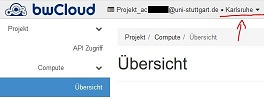
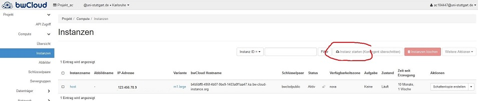

```{r setup, include=FALSE}
knitr::opts_chunk$set(echo = TRUE, eval=F)
```

# Ein CSS Server in der bwCloud

Dieses Skript erklärt, wie man einen Linux Server für CSS Anwendungen einrichtet.
Die benötigte Software für CSS Anwendungen ist frei verfügbar. Anstatt eigene Hardware zu nutzen, wird der Server auf der [bwCloud](http://www.bw-cloud.org) eingerichtet.

[](http://www.bw-cloud.org) 

Die [bwCloud](http://www.bw-cloud.org) ist Infrasctructure as a Service (IaaS), also (Rechner-)Infrastruktur, die als Dienstleistung bereitgestellt wird (durch das Land Baden-Württemberg, für die Hochschulen im Land). 

Was wird genau bereitgestellt? Die bwCloud als Cloud Computing Umgebung besteht aus mehreren Großrechnern. Diese sind verteilt auf vier Rechenzentren, die jeweils für verschiedene Universitäten zuständig sind (im bwCloud-Jargon *Regionen*). Zusammen stellen sie 125 CPUs mit über 2.000 Kernen bereit und verfügen über 3.000 Terabyte Speicher. Davon erhalten registrierte NutzerInnen ein *Kontingent* (i.d.R. 8 Kerne, 16GB Arbeitsspeicher,50GB Speicher). Dieses Kontingent kann man nutzen, um sogenannte *Instanzen* ([Virtuelle Maschinen](https://de.wikipedia.org/wiki/Virtuelle_Maschine)) einzurichten, z.B. mehrere kleine oder eine große. Auf dieser Instanz lässt sich dann das Betriebssystem und Software installieren. 

Verwaltet werden die Ressourcen und Instanzen mittels *Openstack*. Für den Anwender ist das eine Weboberfläche, die es erlaubt Instanzen einzurichten, zu ändern, zu löschen etc. Die Openstack Umgebung ist quasi der Blick von außen auf den Rechner (also die 'Hardware' der Instanz). Um *in* die Instanz rein zu schauen, also Zugriff auf Betriebssystem und Software der Instanz zu bekommen, nutzt man eine sogenannte *SSH Verbindung* (SSH = [Secure Shell](https://de.wikipedia.org/wiki/Secure_Shell)). Die SSH Verbindung ermöglicht einen [kommandozeilen](https://de.wikipedia.org/wiki/Kommandozeile)-basierter Zugang auf die Instanz. Um die SSH-Verbindung vom eigenen Rechner zu Hause auf die Instanz in der bwCloud aufzubauen, benötigt man z.B. [Putty](https://www.putty.org/) oder [MobaXterm](https://mobaxterm.mobatek.net/) (das bietet auch grafische Benutzerführung).


> "With great power comes great responsibility" 

Für die eigenen Instanzen hat man [root](https://de.wikipedia.org/wiki/Root-Konto)-Rechte. Jede/r ist für seine Instanz selbst verantwortlich (und haftbar). Es gibt keinen Admin (außer einem Selbst), der in die jeweilige Instanz reinschaut und sie auf Sicherheitsprobleme prüft. Die Instanz steht mehr oder weniger auf freier Wildbahn im Internet. Wichtig ist daher, dass die [Firewall](https://de.wikipedia.org/wiki/Firewall) so offen wie nötig und so restriktiv wie möglich konfiguriert wird. Das ist aber über die Openstack-Umgebung sehr einfach und komfortabel zu erledigen (unten mehr).Man muss sicherstellen, dass alle sicherheitsrelevante Updates sofort eingespielt werden (kann man automatisieren, siehe unten). Außerdem sollte man sich generell zum Thema Linux Server absichern informieren. Passworte, Zugangsdaten und SSH-Schlüssel (nicht nur für den Server, sondern auch für Software, Code, API-Zugänge etc.) sind sicher zu verwahren und dürfen niemals in die Versionskontrolle (Github) gelangen. 


## Instanz anlegen


Die [bwCloud](http://www.bw-cloud.org) steht allen MitarbeiterInnen und StudentInnen baden-württembergischer Universitäten nach einer kurzen Registrierung zur Verfügung (siehe [erste Schritte](https://www.bw-cloud.org/de/erste_schritte)). Danach kann man sich mit dem regulären ac-Account oder st-Account [anmelden](https://portal.bw-cloud.org/auth/login/?next=/). Die Instanzen sind personenbezogen und nicht an Funktionen oder Institutionen gekoppelt.

Falls nach der Anmeldung keine verfügbaren Kontingente angezeigt werden, liegt das wahrscheinlich daran, dass die falsche Region ausgewählt ist. MitarbeiterInnen und StudentInnen der Universität Stuttgart erhalten ihr Kontingent über die Region Karlsruhe:

 

Zuerst wird eine VM Instanz in der bwCloud unter `Compute -> Instanzen` angelegt:

 

Ein Image aus der Liste auswählen, oder ein eigenes unter `Abbilder` hochladen und installieren. 

Aus unterschiedlichen Gründen ist meine persönliche Empfehlung ein minimal **CentOS 7** als Betriebssystem (Abbild) zu nutzen. Es ist ein sogenanntes Enterprise-Linux, das auf Stabilität, Sicherheit und Langzeitunterstützung ausgelegt ist. Bis mindestens Juli 2024 wird es Updates und Patches geben.

## SSH Zugang

Läuft die Instanz, erfolgt der Zugriff über SSH (z.B. mit [Putty](https://www.putty.org/). Dies erfordert einen SSH-Schlüssel zur Authentifizierung (siehe [hier](https://www.bw-cloud.org/de/erste_schritte#step4)). Jetzt noch die IP-Adresse des Servers (bei `Instanzen`) notieren und mit Putty auf den Server verbinden. 

- In Putty muss bei `Host Name` die IP Adresse angegebe werden: `193.196.39.179`
- Dann muss ein SSH-Schlüssel zur Authentifizierung genutzt werden (siehe [hier](https://www.bw-cloud.org/de/erste_schritte#step4)). Der private Schlüssel muss in Putty importiert werden: `Connection -> SSH -> Auth`. 
- Schließlich muss noch der Benutzername angegeben werden: `Connection -> Data -> auto-login username`. Er lautet `centos`. 

Dann lässt sich mit `open` die Verbindung herstellen. 


## Server einrichten 

CentOS ist ein Linux Betriebssystem. Grundlagen zu Linux gibt es zum Beispiel hier als [Tutorial](https://training.bwhpc.de/ilias/goto.php?target=pg_5066_310&client_id=bwhpc).

Ansonsten gilt: Googlen löst (fast) alle Probleme...

Wird das minimal CentOS 7 installiert, sollten noch der *nano Texteditor* und *wget* (Download-Tool) installiert werden:

```
sudo yum install nano
sudo yum install wget
```

Aus Sicherheitsgründen sollten Updates per Cron-Job automatisiert werden (vgl. [hier](https://linuxaria.com/howto/enabling-automatic-updates-in-centos-7-and-rhel-7)):

```
sudo yum -y install yum-cron
sudo nano /etc/yum/yum-cron.conf
systemctl start yum-cron.service
#Prüfen ob Service läuft
systemctl status yum-cron.service
```


### pscp Dateitransfer

Um Dateien von und zum Server zu schicken, lässt sich das Tool `pscp` nutzen, das mit installiert wird, wenn man Putty auf dem Windows-Rechner installiert.
`pscp` wird von  der Kommandozeile aus gestartet. Um eine Datei *vom Server auf den lokalen Rechner zu kopieren*, auf dem Windows-Rechenr also `cmd` ausführen. Dann:

```
pscp -i "Pfad_zum_private_key" nutzername@server_IP:/Dateipfad/auf/Server/datei.txt C:\Zielpfad\auf\Windows-Rechner
```

Um eine Datei *auf den Server zu kopieren*, wieder `cmd` und dann: 

```
pscp -i "Pfad_zum_private_key" C:\Quelldatei\auf\Windows-Rechner\datei.txt nutzername@server_IP:/Zielpfaf/auf/Server/ 
```


### Python auf Server installieren 

Python am besten für jedes Projekt in einer [virtuellen Umgebung](https://realpython.com/python-virtual-environments-a-primer/) einrichten mit `virtualenv`. Dazu `virtualenv` für Python 3.7 installieren, dann wechseln in das entsprechende Projekt-Verzeichnis, dann virtuelle Umgebung einnrichten und aktivieren.
```
sudo yum install openssl-devel.x86_64
sudo python3.7 -m pip  install virtualenv
cd /home/NAME/PROJEKT
virtualenv -p python3.7 env
source env/bin/activate
```

Libraries können dann einfach über `requirements.txt` installiert werden:

```
pip install -r requirements.txt
```

### RStudio Server installieren

Detaillierte Anleitung [hier](https://rstudio.com/products/rstudio/download-server/)


### Datenbank auf Server erstellen

[MariaDB](https://mariadb.org/) als SQL Datenbank mit `yum` installieren und konfigurieren. Schließlich bei Boot aktivieren:

```
yum install mariadb-devel
sudo systemctl enable mariadb
sudo systemctl start mariadb
sudo mysql_secure_installation
```

#### Neue Datenbank anlegen

Datenbank `TestDB` mit Nutzerrechten für `TestDB_user` und der Möglichkeit des Logins über das Uni-Netz (einmal LAN und einmal VPN)

```
#Anmelden an MariaDB als root 
mysql -u root -p
#SHOW DATABASES;
#DROP DATABASE TestDB;

CREATE DATABASE IF NOT EXISTS TestDB
    DEFAULT CHARACTER SET utf8
    DEFAULT COLLATE utf8_general_ci;

USE TestDB;
GRANT ALL PRIVILEGES ON TestDB.* TO 'TestDB_user'@'localhost' IDENTIFIED BY 'passwort_hier'
    WITH GRANT OPTION;
GRANT ALL PRIVILEGES ON *.* TO 'TestDB_user'@'ERLAUBTE IP-ADRESSE/ADRESSBERECIH EINFÜGEN%' IDENTIFIED BY 'passwort_hier' 
  WITH GRANT OPTION;
FLUSH PRIVILEGES;
exit
# dann firewall:
firewall-cmd --add-port=3306/tcp 
```
Prüfen welche Nutzer in der Datenbank welche Rechte haben

```{sh}
mysql -u root -p
SELECT User, Db, Host from mysql.db;
```

### Git installieren

[Git](https://de.wikipedia.org/wiki/Git) hilf bei der Versionsverwaltung.

```
sudo yum git
git config --global user.name "Your Name"
git config --global user.email "you@example.com"
```

In das entsprechende Verzeichnis wechseln `/home/NAME`, dann git per Shell nutzen:
```
git clone REPOSITORY_URL --branch release

#für commit
git commit -a
#Komemntar eingeben und mit `:wq` speichern.

#für push
git push origin

#Auf bestimmten Branch wechseln:
git checkout master

#und ziehen: 
git pull origin
```


